# 🏢 نظام إدارة وتقييم الموظفين

نظام متكامل لإدارة الموظفين والموارد البشرية مع إمكانية التحكم في الأدوار والصلاحيات، بالإضافة إلى تقارير شاملة لقياس الأداء وتوزيع المهام.

---

## 📋 القائمة الرئيسية (لوحة التحكم)

### 👤 الموظفين
- الموظفين  
- تقارير  
- تقارير (حسب الأقسام)  
- إدارة (الوحدات)  
- قسم  
- الموقع  
- الدرجة  
- وظائف  
- منصب  

### 🆔 الأدوار
- إدارة الأدوار والصلاحيات  

### 🧑‍✈️ الموارد البشرية
- لوحة الموارد البشرية  

### ⚙️ الإعدادات
- الإعدادات العامة للنظام  

---

## 🚀 مميزات النظام
- إدارة شاملة للموظفين مع معلومات تفصيلية.  
- إنشاء وعرض تقارير الأداء للموظفين والأقسام.  
- إدارة كاملة للوحدات، الأقسام، المواقع، الدرجات، الوظائف، والمناصب.  
- نظام أدوار وصلاحيات مرن للتحكم بالمستخدمين.  
- لوحة مخصصة لإدارة الموارد البشرية.  
- إعدادات عامة للتحكم في بيانات وشكل النظام.  

---

## 🖼️ صور من النظام

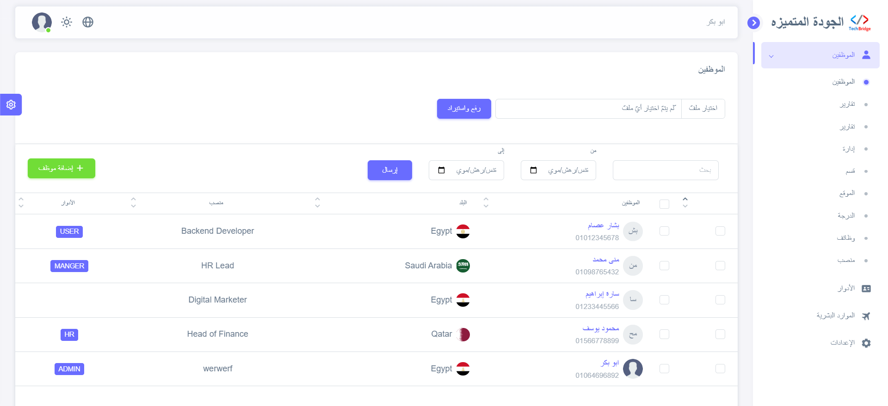  
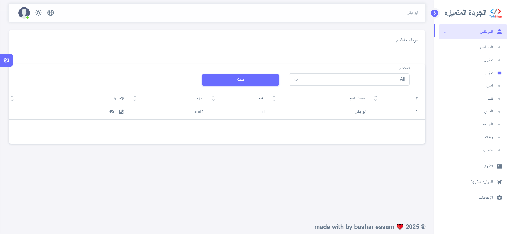  
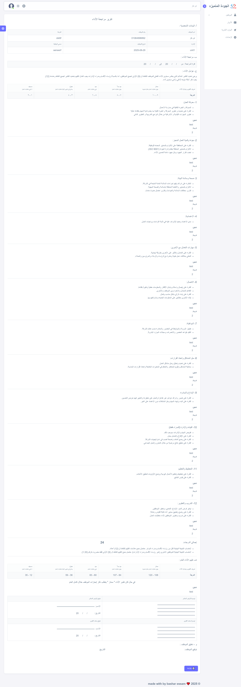  
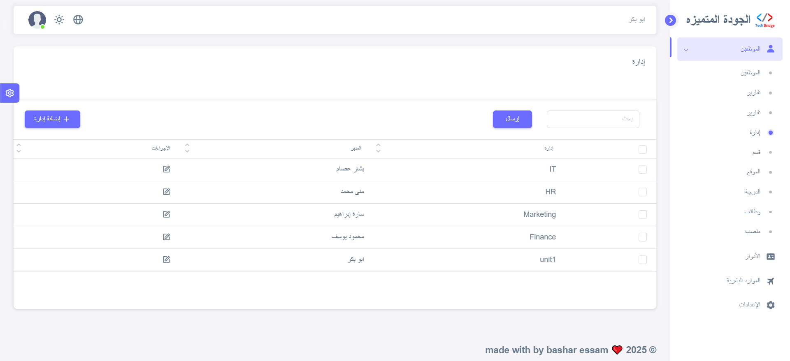  
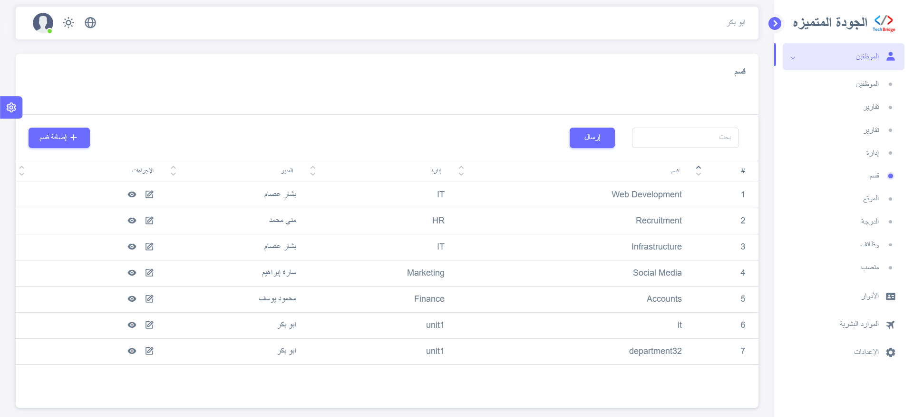  
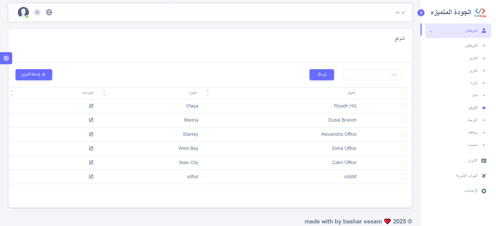  
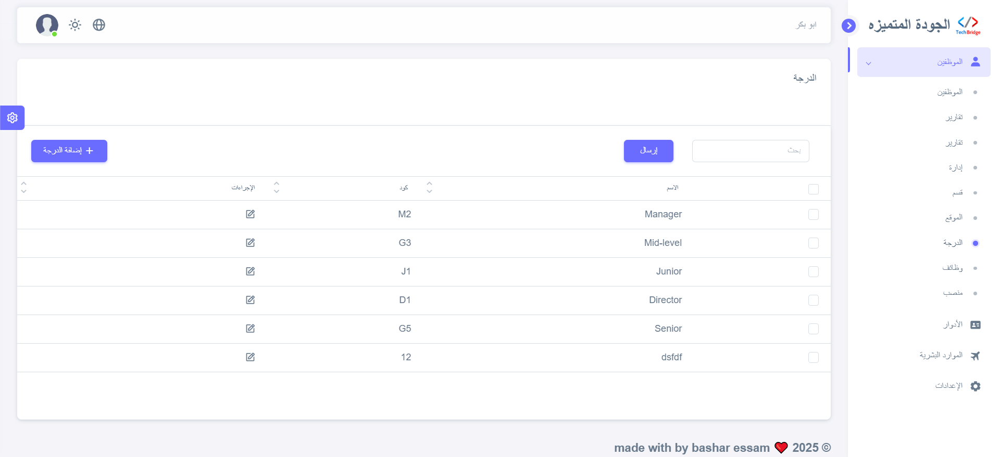  
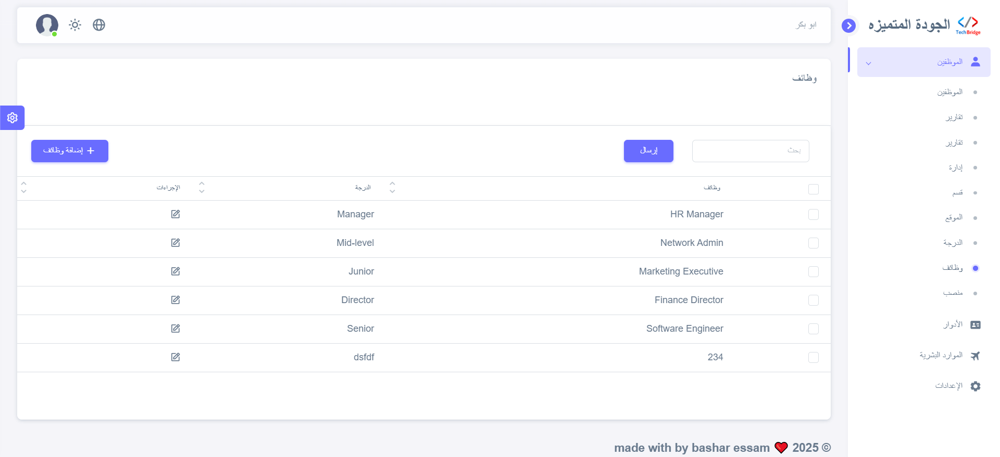  
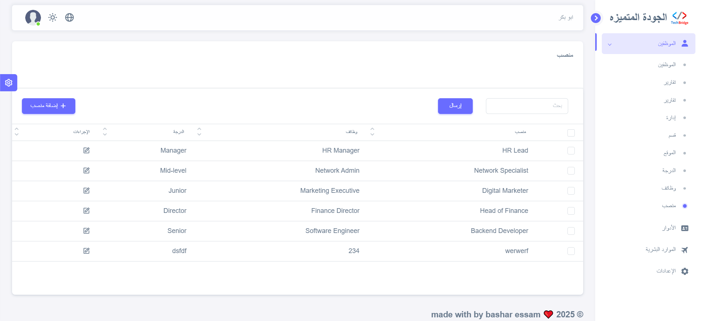  
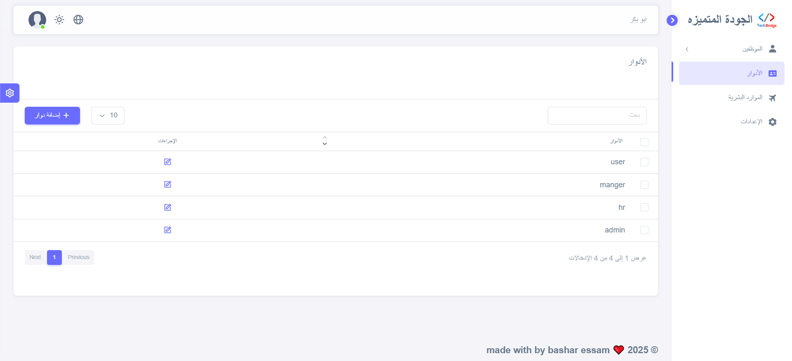  
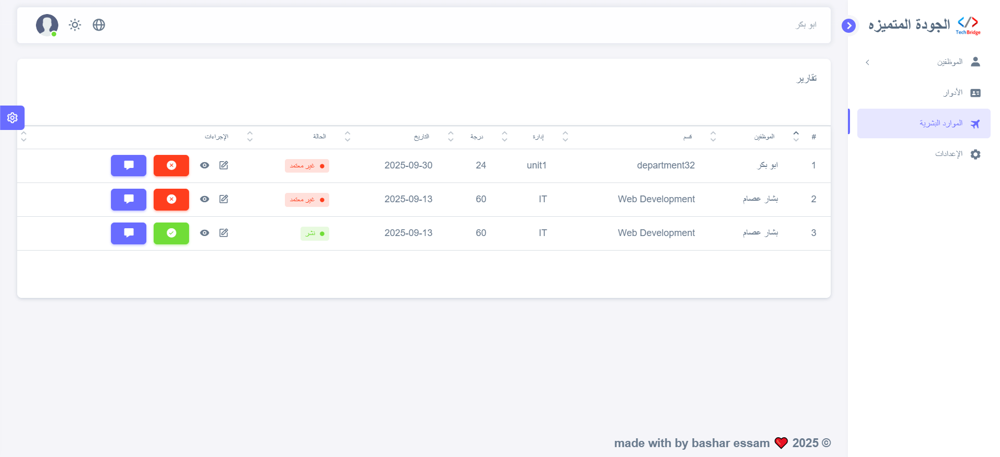  
